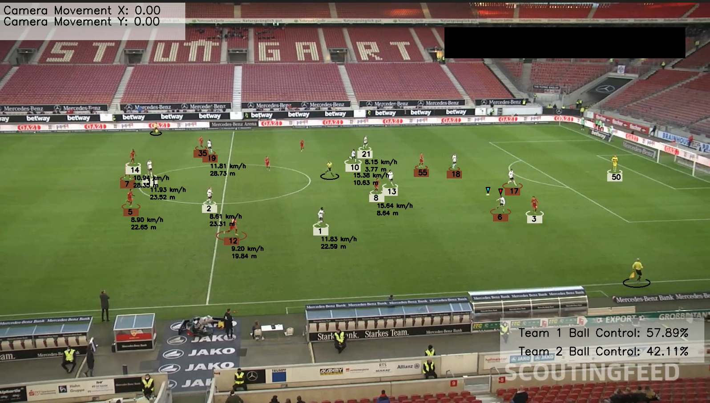

# Football Analysis Project

## Overview
This project aims to analyze football matches using various computer vision techniques. The analysis includes player tracking, ball tracking, speed and distance calculations, and more. The following methods are used:
- Color segmentation using KMeans for uniform detection
- Player tracking
- Model fine-tuning for better detection of players, referees, and the ball
- Ball interpolation
- Speed and distance calculation
- Motion tracking
- Perspective transformation using YOLO

## Tools
- OpenCV
- ultralytics
- YOLO
- Scikit-learn
- Supervision
